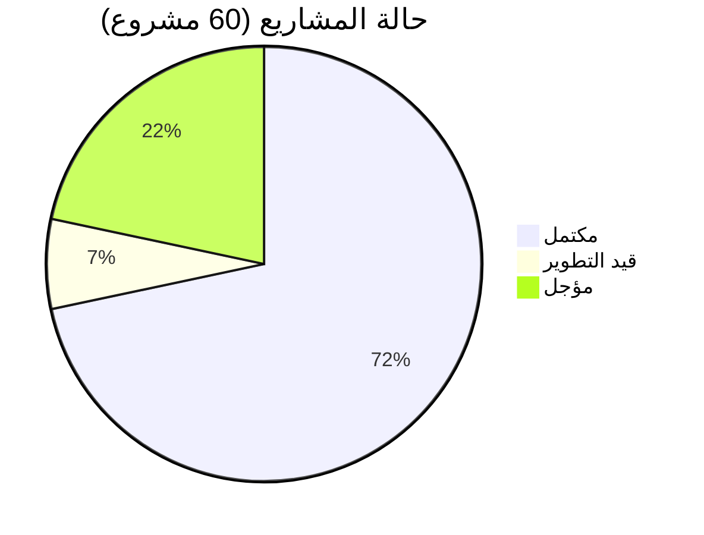

  
# 👨‍💻 مرحباً في عالم Alambrator100k

### مطور ويب | مصمم أدوات تفاعلية | صانع محتوى تقني

---

## 📊 إحصائيات سريعة

🟢 مكتمل 🟡 قيد التطوير 🔴 مؤجل المجموع
43 4 13 60

🚀 أبرز المشاريع المميزة

🌐 مواقع ويب متكاملة

المشروع الوصف التقنيات الرابط
as موقع سيرة ذاتية تفاعلي وشخصي HTML 🔗 عرض
Services منصة لطلب الخدمات الرقمية HTML, CSS, JS 🔗 عرض
ai مدونة متخصصة في الذكاء الاصطناعي HTML 🔗 عرض
cv مصمم صور السيرة الذاتية الاحترافي HTML, CSS, JS 🔗 عرض

🛠️ أدوات تقنية مفيدة

المشروع الوصف التقنيات الرابط
reader-pdf-pro قارئ PDF بمميزات استثنائية HTML 🔗 عرض
mind-map مصمم خرائط ذهنية احترافي JS 🔗 عرض
Featured-text زخرفة وتصميم النصوص بأشكال فنية HTML 🔗 عرض
Shorten-links- أداة اختصار الروابط وإنشاء QR Code HTML 🔗 عرض

🎮 ألعاب تفاعلية

المشروع الوصف التقنيات الرابط
hak_v3 لعبة محاكاة الهاكر (الإصدار الثالث) JS 🔗 عرض
rat لعبة محاكاة RAT في المتصفح HTML 🔗 عرض

📊 أدوات تحليل وفحص

المشروع الوصف التقنيات الرابط
Track-information أداة متقدمة لجمع وتتبع المعلومات HTML, CSS, JS 🔗 عرض
to-examine-WEB أداة تحليل وفحص المواقع (تحت التطوير) HTML, JS 🔗 عرض

🎨 أدوات إبداعية

المشروع الوصف التقنيات الرابط
slogan تصميم شعارات مخصصة مع إيموجي HTML 🔗 عرض
Image-ascii-3 تحويل الصور إلى نصوص ASCII (v3) HTML 🔗 عرض

📈 إحصائيات GitHub

https://github-readme-stats.vercel.app/api?username=Alambrator100k&show_icons=true&theme=tokyonight&locale=ar

https://github-readme-stats.vercel.app/api/top-langs/?username=Alambrator100k&layout=compact&theme=tokyonight&locale=ar

https://github-readme-streak-stats.herokuapp.com/?user=Alambrator100k&theme=tokyonight&locale=ar

🛠️ المهارات والتقنيات

https://img.shields.io/badge/HTML5-E34F26?style=for-the-badge&logo=html5&logoColor=white
https://img.shields.io/badge/CSS3-1572B6?style=for-the-badge&logo=css3&logoColor=white
https://img.shields.io/badge/JavaScript-F7DF1E?style=for-the-badge&logo=javascript&logoColor=black
https://img.shields.io/badge/Python-3776AB?style=for-the-badge&logo=python&logoColor=white
https://img.shields.io/badge/Git-F05032?style=for-the-badge&logo=git&logoColor=white
https://img.shields.io/badge/GitHub-100000?style=for-the-badge&logo=github&logoColor=white

🌟 المشاريع المميزة (Pinned)

📌 <strong>عرض جميع المشاريع الـ 60</strong> (اضغط للعرض)

✅ مكتملة (43 مشروع)

· HTML/CSS/JS: as, rat, rat1, Collect-image-information-, Collect-image-information-1, Shorten-links-, -, System-stress-V1, stress-test-V2, System-stress-V3, py, URL, ai, html2, cv, cv1, English4Dev, RAT-AS, Services, a-store-, Featured-text, slogan, reader-pdf-pro, reader-pdf-, Image-ascii-3, Image-ascii, Image-ascii-2, ##2
· JavaScript Games: hak_v1, hak_v2, hak_v3
· Tools: Track-information, mind-map, Collect-image-information-, Shorten-links-, System-stress-V1, stress-test-V2, System-stress-V3, Featured-text, slogan, reader-pdf-pro, reader-pdf-, Image-ascii-3, Image-ascii, Image-ascii-2

🟡 قيد التطوير (4 مشاريع)

· to-examine-WEB - أداة فحص المواقع (HTML/JS)
· بالإضافة إلى 3 مشاريع أخرى قيد التحديث

🔴 مؤجلة (13 مشروع)

مجموعة من المشاريع التجريبية والأفكار المؤجلة للتطوير المستقبلي

📫 تواصل معي

https://img.shields.io/badge/GitHub-100000?style=for-the-badge&logo=github&logoColor=white
https://img.shields.io/badge/Gmail-D14836?style=for-the-badge&logo=gmail&logoColor=white

---

💡 "لا تتوقف عن التعلم، ولا تتوقف عن الإبداع"

آخر تحديث: ديسمبر 2024

https://capsule-render.vercel.app/api?type=waving&color=gradient&height=100&section=footer

